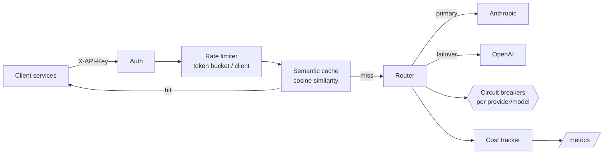

# LLM Gateway

**One reliable API in front of every model provider.** A production-pattern gateway for teams running GenAI in production: smart routing with automatic failover, per-target circuit breakers, semantic response caching, per-client rate limits, and cost accounting — all observable through a single `/metrics` endpoint.

## Why

Once more than one team calls more than one model, every service ends up re-implementing the same plumbing: retries, provider outage handling, key management, cost attribution. A gateway centralizes that operational layer so application code makes one call and the platform team keeps control of reliability and spend.

## Architecture



**Request path:** authenticate → rate limit → cache lookup → route (retries + failover + circuit breaking) → record cost → cache store.

### Reliability model

- **Route aliases, not model ids.** Clients ask for `"default"` or `"fast"`; the platform decides which provider/model serves it. Models can be swapped fleet-wide without a single client change.
- **Ordered failover with retries.** Each route is an ordered target list. Transient failures retry with exponential backoff; persistent failures fail over to the next target.
- **Per-target circuit breakers.** A target that fails repeatedly gets its circuit opened and is skipped for a cooldown window, so a degraded provider can't add timeout latency to every request.
- **Semantic caching.** Prompts are embedded (hashing-trick BOW by default — deterministic, microsecond-fast, zero dependencies) and near-duplicate requests on the same route are served from cache. The embedder is a single pluggable function; swap in a real embedding model for stronger paraphrase recall.
- **Cost controls.** Every response is priced from a per-model table and attributed to the calling client key; `/metrics` exposes per-client spend, token usage, cache hit rates, and breaker states.

## API

```bash
curl -s localhost:8000/v1/chat \
  -H 'X-API-Key: demo-key' \
  -H 'Content-Type: application/json' \
  -d '{
    "model": "default",
    "messages": [{"role": "user", "content": "Summarize our refund policy"}]
  }'

# => {"text": "...", "provider": "anthropic", "model": "claude-sonnet-4-6",
#     "usage": {"input_tokens": 11, "output_tokens": 64}, "cached": false, "cost_usd": 0.000993}

curl -s localhost:8000/metrics -H 'X-API-Key: demo-key'
# => {"cache": {"hits": 3, "misses": 9},
#     "clients": {"demo-key": {"requests": 12, "cost_usd": 0.004113, ...}},
#     "circuit_breakers": {"anthropic/claude-sonnet-4-6": {"open": false, ...}}}
```

## Quickstart

```bash
git clone https://github.com/harshpatel262/llm-gateway && cd llm-gateway
python3 -m venv .venv && source .venv/bin/activate
pip install -e ".[dev]"

# real providers (either or both; two providers enables cross-provider failover)
export GATEWAY_ANTHROPIC_API_KEY=sk-ant-...
export GATEWAY_OPENAI_API_KEY=sk-...
# or run fully offline against the mock provider
export GATEWAY_MOCK_MODE=true

uvicorn llm_gateway.main:app --reload
```

Tests run offline, no keys required:

```bash
pytest -v
```

## Configuration

| Variable | Default | Description |
|---|---|---|
| `GATEWAY_ANTHROPIC_API_KEY` / `GATEWAY_OPENAI_API_KEY` | — | Upstream provider keys |
| `GATEWAY_CLIENT_KEYS` | `{"demo-key": 60}` | JSON map of client API key → requests/minute |
| `GATEWAY_CACHE_TTL_SECONDS` | `300` | Semantic cache entry lifetime |
| `GATEWAY_CACHE_SIMILARITY_THRESHOLD` | `0.97` | Cosine similarity needed for a cache hit |
| `GATEWAY_BREAKER_FAILURE_THRESHOLD` | `3` | Consecutive failures before a target's circuit opens |
| `GATEWAY_BREAKER_COOLDOWN_SECONDS` | `30` | How long an open circuit skips its target |
| `GATEWAY_MOCK_MODE` | `false` | Route everything to the offline mock provider |

## Roadmap

- [ ] Streaming (SSE) pass-through with token-level cost metering
- [ ] Redis backends for cache and rate limits (multi-instance deployments)
- [ ] Per-client monthly budget caps with hard/soft enforcement
- [ ] Prometheus exposition format for `/metrics`

## License

MIT
